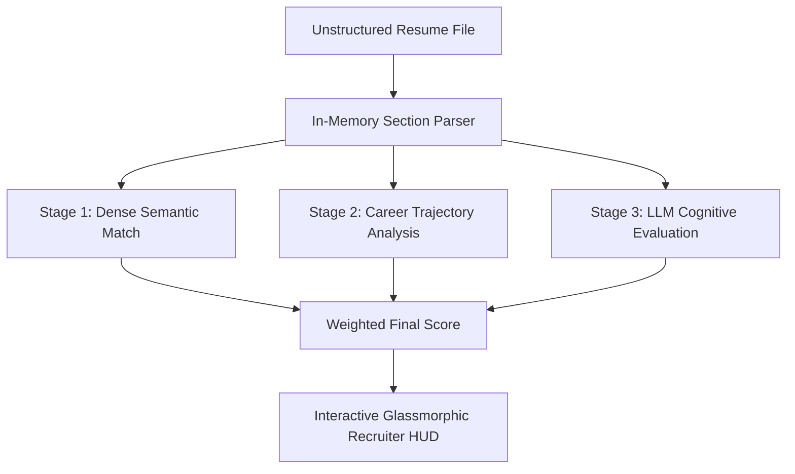

# Product Requirements Document (PRD)
## Project Name: TalentSphere (Cognitive Candidate Ranking Engine)

Recruiters spend hours scanning resumes only to miss elite talent due to rigid keyword filters. Simple string matches cannot see career progression, domain suitability, or technical depth. 

**TalentSphere** is a premium, AI-driven Applicant Tracking System (ATS) designed to rank candidates the way an elite human recruiter would—not by matching words, but by deeply understanding the full trajectory, skills, and cognitive fit of the candidate against the role.

---

## 1. Product Vision & Goals
- **Core Objective**: Replace fragile keyword screening with multi-stage hybrid ranking (semantic search + trajectory modeling + qualitative LLM analysis).
- **Recruiter Trust**: Provide complete transparency for rankings with visual score breakdowns, identified strengths, gaps, and tailored interview questions.
- **Zero Ingestion Friction**: Support real-time drag-and-drop parsing of PDF, Word (doc/docx), Markdown, and plain text files with 100% in-memory safety.
- **HUD User Experience**: Offer a state-of-the-art recruiter cockpit featuring a glassmorphic night-mode UI, 3D hologram scanning sweeps, and interactive evaluation scorecards.

---

## 2. Target User Persona
- **Direct User**: Sourcing Directors, Technical Recruiters, and Sourcing Coordinators.
- **Needs**:
  - Quickly isolate the top 5% candidates from a pile of 500+ dynamic CV formats.
  - Understand *why* a candidate fits without manually scanning full histories.
  - Generate custom screening prompts instantly for deep-dive calls.

---

## 3. System Architecture & Multi-Stage Scoring
TalentSphere utilizes a hybrid three-stage ranking algorithm to assign a final weighted overall score:

$$\text{Overall Score} = (0.3 \times S_{\text{semantic}}) + (0.3 \times S_{\text{trajectory}}) + (0.4 \times S_{\text{cognitive}})$$

### Stage 1: Dense Retrieval & Semantic Similarity ($S_{\text{semantic}}$) - 30% Weight
- **Logic**: Converts the unstructured resume text and active target JD into dense mathematical vectors using **Gemini Embedding v2 (`gemini-embedding-2-preview`)** with 3072 dimensions.
- **Metric**: Computes the cosine similarity between candidate and JD vectors.
- **Local Fallback**: Employs a deterministic, local mathematical hash-vector store when offline, mapping tech-keyword overlaps to preserve retrieval integrity.

### Stage 2: Algorithmic Career Trajectory Model ($S_{\text{trajectory}}$) - 30% Weight
- **Tenure Stability (40%)**: Calculates average tenure across all job history blocks. Promotes stability (average tenure $\ge 3$ years receives $100\%$ score).
- **Vertical Scope Growth (30%)**: Scans titles for vertical progression cues (e.g. from developer to lead or architect) or vertical growth triggers.
- **Experience Match Gap (30%)**: Mathematically calculates the delta between candidate years of experience and target minimum JD experience.

### Stage 3: LLM Cognitive Evaluation ($S_{\text{cognitive}}$) - 40% Weight
- **Logic**: Leverages the **Gemini 3.5 Flash (`gemini-3.5-flash`)** model to read the candidate profile and target JD together.
- **Assessments**:
  - Technical Depth Score (0-100)
  - Soft Skills Alignment Score (0-100)
  - Domain Fit Score (0-100)
  - Growth Potential Score (0-100)
- **Qualitative Output**: Generates custom strengths, developmental gaps, fit justifications, and three tailored screening questions.

---

## 4. Key Functional Features

### 4.1. In-Memory Multi-Format CV Parser
- **Binary Streams**: Safe in-memory decoding of `.pdf`, `.docx`, `.doc`, `.md`, and `.txt` files. Zero file serialization to temporary paths to ensure high performance and enterprise data security.
- **Intelligent Section-Based Fallback**:
  - Classifies lines sequentially into disjoint blocks (`HEADER`, `SUMMARY`, `SKILLS`, `EXPERIENCE`, `EDUCATION`).
  - Separates names and designations at keyword boundaries (e.g. splits `Dandothkar Manik Prabhu` from `Senior Inside Sales Manager`).
  - Automatically cleans domain extensions (`gmail.com`), emails, trailing brackets, and filters out academic lines from work experience.

### 4.2. Recruiter Command Cockpit (HUD)
- **Nocturnal Glassmorphism**: Tailored HSL theme with deep slate colors, semi-transparent layers, backdrop blur, and neon glowing accents.
- **3D perspective Rotated Scanner**: Displays a tilted holographic overlay (`perspective(1000px)`) with a vertical neon laser sweep line during evaluation.
- **Dynamic 3D Result Settle**: Performs a custom slide-and-settle animation to present evaluation scores, matching JD requirements badges, and key strengths.
- **Interactive Details Drawer**: A slider sheet displaying full candidate timelines, progress bars, and custom screening prompts.

---

## 5. Non-Functional Requirements
- **Performance**: Ingestion and hybrid mathematical ranking of a new CV must complete within 2 seconds.
- **Security**: Resumes are processed in-memory inside short-lived streams. Zero permanent storing of user data.
- **Scalability**: Local vector hash buffers fallback gracefully to sustain 100% operational uptime when third-party cloud engines are unreachable.
- **Compatibility**: Responsive support for high-DPI screens and vertical recruiter displays.
