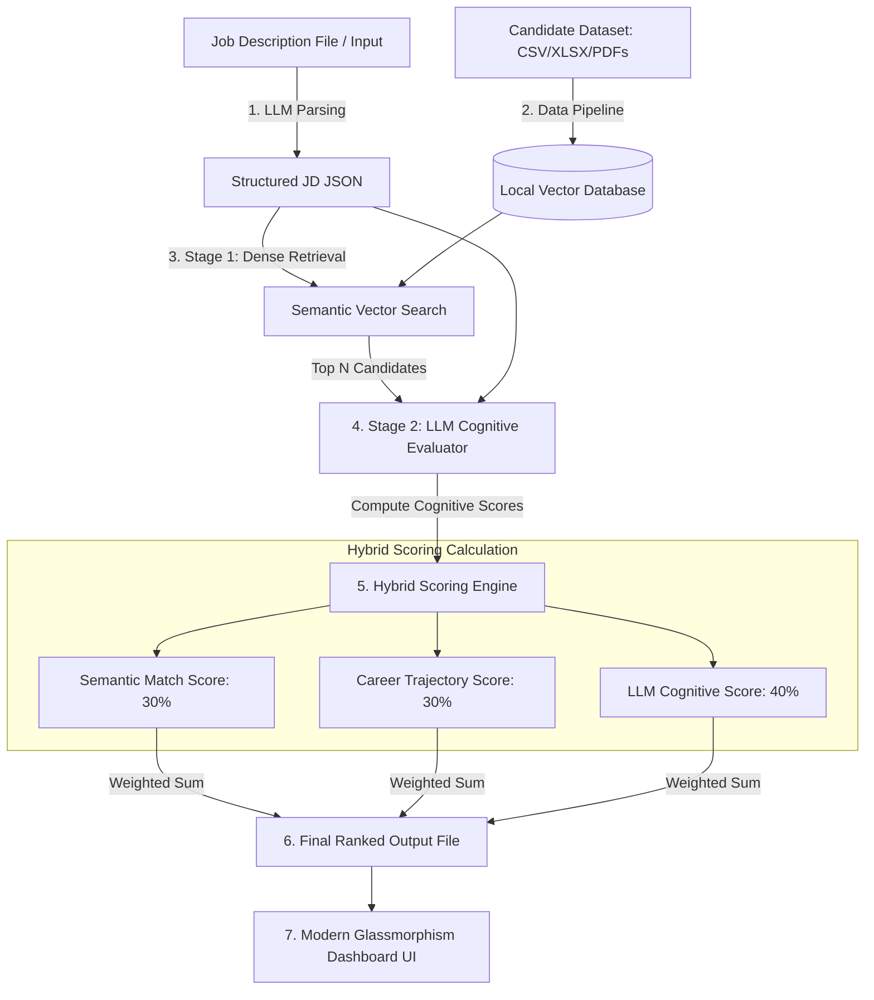

# TalentSphere: Cognitive Candidate Ranking Engine

Traditional applicant tracking systems (ATS) rely on brittle keyword filters, which leads to high rates of false negatives (great candidates filtered out because they didn't write the exact keywords) and false positives (poor candidates who optimized their resumes with buzzwords).

**TalentSphere** is a high-fidelity, cognitive recruitment ranking engine designed to evaluate candidates like an elite technical recruiter would. It goes beyond simple keywords by analyzing:
1. **Contextual Skill Application**: Determining the depth, longevity, and recency of skill usage rather than just counting keyword occurrences.
2. **Career Progression & Trajectory**: Assessing job stability, promotions, role growth, and leadership signals.
3. **Domain Fit & Environmental Alignment**: Evaluating if a candidate's background matches the scale and operational realities of the role (e.g., scale of systems managed, team sizes, startup vs. enterprise context).
4. **Behavioral & Soft Signals**: Identifying soft skills, mentorship activities, and open-source contributions.

---

## Technical Architecture Overview

To achieve scale, cost-efficiency, and highly accurate ranking, we utilize a **Multi-Stage Hybrid Pipeline**:

### The Scoring Algorithm
The overall match score (0-100) is calculated as:
$$\text{Final Score} = w_{\text{semantic}} \cdot S_{\text{semantic}} + w_{\text{trajectory}} \cdot S_{\text{trajectory}} + w_{\text{cognitive}} \cdot S_{\text{cognitive}}$$

*   **$S_{\text{semantic}}$ (30%)**: Calculated using Dense Vector Embeddings (Gemini embeddings or HuggingFace local model), comparing the structured candidate profile against the job description.
*   **$S_{\text{trajectory}}$ (30%)**: Algorithmic evaluation of role durability (tenure, average job duration), career growth (change in titles towards seniority), and aggregate years of relevant experience.
*   **$S_{\text{cognitive}}$ (40%)**: Deep reasoning score calculated via a targeted LLM prompt (Gemini 2.0/1.5 Pro) that scores key areas: *Technical Depth*, *Soft Skills Alignment*, *Domain Fit*, and *Growth Potential*.

---

## 4-Day Winning Roadmap

To ensure a top-tier submission within **4 days**, we will execute the following structured sprint:

*   **Day 1: Data Strategy & Backend Infrastructure (Foundations)**
    *   Initialize backend structure (Python, FastAPI).
    *   Set up data schemas with **Pydantic** representing parsed job descriptions and normalized candidate profiles.
    *   Build the `LLMParser` which takes raw text (or PDF) JDs/profiles and extracts a standardized, rich JSON structure.
    *   Initialize local in-memory/disk vector database (**ChromaDB** or **Qdrant-client**) to support fast, dependency-free semantic searches.

*   **Day 2: Scoring & Hybrid Ranking Engine ("The Brain")**
    *   Implement **Stage 1 (Semantic Retrieval)**: Compute embedding similarity scores between profiles and JDs.
    *   Implement **Stage 2 (Career Trajectory Evaluator)**: Algorithmic assessment of job durations, stability, and growth trajectories.
    *   Implement **Stage 3 (LLM Cognitive Evaluation)**: Orchestrate prompt-engineering sequences using **Gemini** to calculate deep alignment metrics and qualitative justifications.
    *   Integrate and tune weights to generate highly accurate candidate shortlists.
    *   Export the candidate ranks into the required output format (CSV/Excel).

*   **Day 3: Premium Frontend Dashboard ("The Experience")**
    *   Set up a **Vite + React** frontend in the workspace.
    *   Establish a beautiful CSS Design System: Sleek dark mode, glassmorphism containers, smooth modern gradients, Outfit/Inter typography, and subtle micro-animations.
    *   Develop the **Recruiter Dashboard**:
        *   **JD Uplink**: A beautiful textbox or upload area to upload new job descriptions.
        *   **Ranking Board**: A high-fidelity data table displaying candidate ranks, overall match scores, core strengths, and visual badges.
        *   **Cognitive Drawer**: A slide-out panel that displays a rich visualization of candidate metrics (radar charts), full parsed work histories, and AI analysis (Strengths, Development Areas, Custom Interview Questions).

*   **Day 4: E2E Validation, Pitch Deck, & Final Polish**
    *   Run multiple data runs and verify output consistency.
    *   Write the comprehensive `README.md` and automated setup scripts (`run.ps1` / `run.sh`).
    *   Produce a **high-impact 10-slide deck** in markdown/HTML, export it to PDF, explaining the engineering choices, scoring models, and why our system ranks like an elite human recruiter.
    *   Finalize repository structure, lint, and prepare for immediate execution.

---

## Technical File Structure

Here is the initial file structure we will build inside the workspace:

### Backend Engine
*   `backend/main.py`: FastAPI entry point providing endpoints to parse JDs, retrieve rankings, and serve candidate detail cards.
*   `backend/schemas.py`: Pydantic classes mapping out the structured metadata of Job Descriptions, Work History, Skills, and Cognitive Scores.
*   `backend/parser.py`: Orchestration of Gemini models to parse unstructured resumes (PDFs/Text) and JDs into structured schemas.
*   `backend/ranker.py`: Core hybrid logic computing embedding similarities, trajectory scoring, and deep LLM evaluations.
*   `backend/vector_store.py`: ChromaDB vector operations (indexing candidate records, searching profiles).

### Frontend UI
*   `frontend/index.html`: Core HTML setup linking to React and custom typography styles.
*   `frontend/src/index.css`: Core styling with custom modern color palette, HSL custom variables, dark-mode styling, glassmorphism utilities, and smooth micro-animations.
*   `frontend/src/App.jsx`: Main React application hosting page layouts, the Recruiter Dashboard, and the slide-out drawers.

---

## Action Items & Setup Questions

To start coding, we need to address:
1. **Dataset Location & Format**: Have you received the candidate dataset and target job description files? What format are they in, and where should we place them?
2. **Expected Output Format**: Do you have a specific template or column schema for the "ranked candidate output file"?
3. **Gemini API Key**: Do you have a Gemini API key available that we can place in a local `.env` file?
